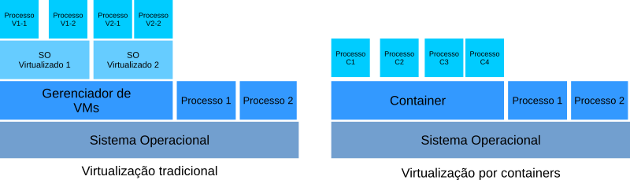

= Guia itexto de Docker

== Siglas

* SO - Sistema Operacional
* VM - Virtual Machine (Máquina Virtual)

== Introdução

Este guia foi inicialmente escrito para ser usado como referência rápida pelos consultores da itexto e também para validar meu conhecimento sobre o Docker conforme progredia minha pesquisa sobre a ferramenta.

Como todos os guias da itexto, não é seu objetivo ser uma fonte profunda de conhecimento sobre o assunto, mas sim um ponta-pé inicial para que você possa começar a usar a ferramenta e, quem sabe, se aprofundar nela no futuro.

É importante salientar que há algumas opiniões minhas neste texto e que, portanto, devem ser levadas com uma pitada de sal.

Dentre estas opiniões está a forte impressão que esta ferramenta deixou em mim. Docker mudou bastante o modo como interajo com o Linux e o modo como via a configuração de servidores. Ao ponto de me motivar a escrever este guia. :)

Graças a ele posso hoje executar meus experimentos de configuração com uma produtividade que jamais imaginei. Mais que isto: Docker me permitiu também documentar (e versionar) de uma forma bastante prática como nossos servidores são configurados e mantidos.

== O que é o Docker?

_"Uma ferramenta que nos permite automatizar a implantação de software em 'containers' ao nos prover uma abstração a mais em cima do sistema operacional."_

Esta foi a primeira descrição que encontrei do Docker e, devo confessar, não a entendi bem naquele momento. Sendo assim, para lhe poupar tempo, vou dissecá-la aqui.

=== Container ou Máquina Virtual?

A primeira impressão que tive do Docker foi a de se tratar de mais uma tecnologia de gestão de máquinas virtuais, tal como o Oracle VirtualBox ou o VMWare. Talvez algo que automatizasse a criação destas VMs, tal como o Vagrant.

E esta confusão, devo confessar, me afastou da ferramenta por um tempo, pois não via razões para adotá-la já que Vagrant, VMWare e VirtualBox já eram dominados por nós. A situação mudou bastante quando iniciei minha pesquisa acerca dos containers Linux.

Essencialmente o 'container' tem como principal função isolar um conjunto de processos dentro de uma instância do sistema operacional. Estes processos não terão acesso direto aos demais executados pelo SO ou vice-versa.

Surge portanto uma primeira definição que, apesar de rudimentar, nos ajudará a compreender melhor o Docker: o container como 'agrupador de processos'.

Mais que um 'agrupador de processos', um 'isolante' dos mesmos, visto que os processos que pertencem ao container não sabem o que ocorre fora deste e vice-versa.

Tal como exporei mais a frente, este 'agrupador de processos' também nos permite definir a quantidade de recursos computacionais serão alocados para si. É possível, por exemplo, definir que os processos pertencentes a um container possuirão acesso a apenas 20% da CPU e 40% da memória RAM disponível no servidor.

Mas a VM também não isola processos? Sim, ela isola, mas mais do que isto, ela também inicia um SO isolado (em seu próprio container), o que nos trás um overhead significativo. No caso do Docker, temos o mesmo SO sendo executado, com a diferença de ser compartilhado por diversos containers, o que reduz significativamente este overhead e, ainda mais importante, diminui consideravelmente o tempo necessário para iniciar o container (você não precisa esperar por um boot).

Confuso? Talvez a imagem a seguir clareie melhor estes conceitos:

Enquanto na virtualização tradicional temos a criação de novas instâncias de sistemas operacionais (podendo estes, inclusive, serem diferentes do Sistema Operacional base (hospedeiro)), no caso dos containers o que realmente temos é um isolamento de processos.

Os processos isolados pelo container serão executados
